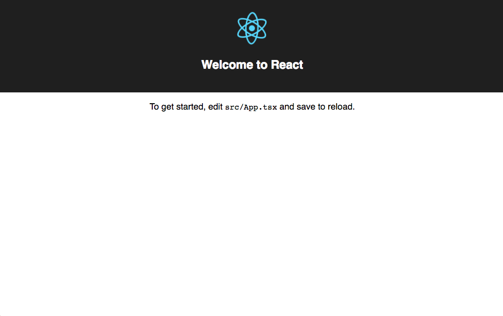
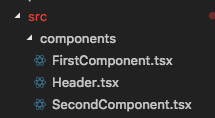
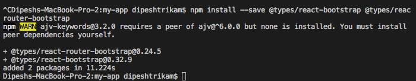
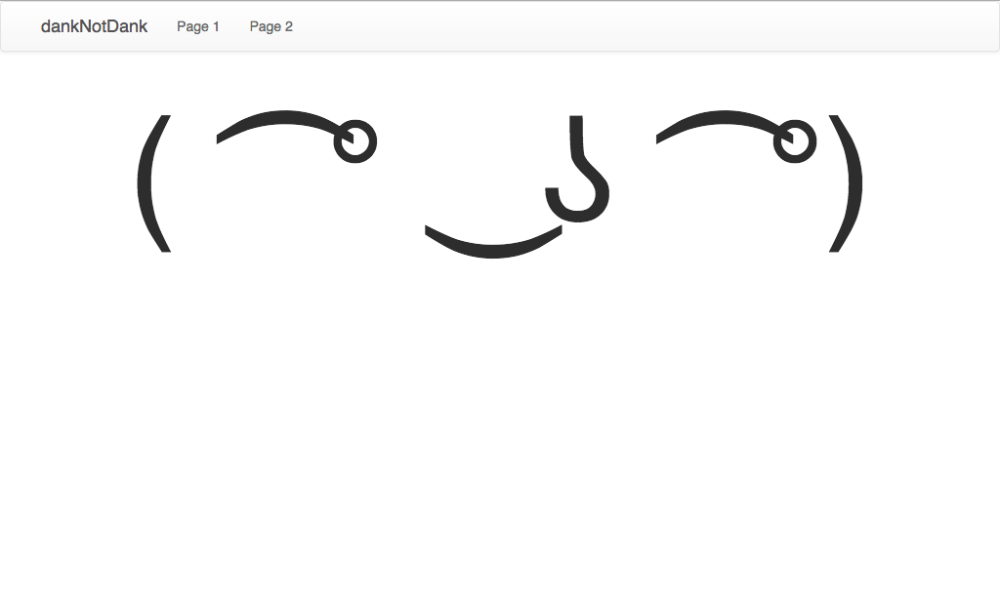

# 1. Base Project + Code environment set up
## [Introduction](https://medium.freecodecamp.org/when-should-i-use-typescript-311cb5fe801b) 

As developers we more than often will be working in teams, which could mean that our codebase is large, a type system can help you avoid a lot of common errors. This is especially true for single-page applications.

Any time one developer could introduce breaking changes, it’s generally good to have some sort of safety mechanism.

The TypeScript transpiler reveals the most obvious mistakes — though it won’t magically eliminate the need for debugging.

If your codebase isn’t all that big, it probably doesn’t make sense to make it larger by adding type annotations. I’ve converted 180+ files from JavaScript to TypeScript, and in most cases it added roughly 30% to the total code size.

Typescript gives react developers many benefits such as autocomplete, type checking, compile time errors which increases productivity and other refactoring benefits. 

### Learning Outcomes from this module:

* How to create a basic react application with typescript
* How to navigate the terminal within Visual Studio Code
* What are components?
* How to route pages in react
* How to implement bootstrap in a react project
* How to link custom global stylesheets to your entire react application.

# Getting started

Make sure you have npm installed, and updated Run: 

If not follow this to [install](https://www.npmjs.com/get-npm)

```sh
[sudo] npm i -g npm to update  
```

This quick start guide will teach you how to wire up TypeScript with [React](http://facebook.github.io/react/).

By the end, you'll have:

* A project with React and TypeScript
* Use react-navigation for navigating web pages
* react-bootstrap to make a responsive web app

We'll use the [create-react-app](https://github.com/facebookincubator/create-react-app) tool to quickly get set up.

We assume that you're already using [Node.js](https://nodejs.org/) with [npm](https://www.npmjs.com/).
You may also want to get a sense of [the basics with React](https://facebook.github.io/react/docs/hello-world.html).

# Install create-react-app

We're going to use the create-react-app because it sets some useful tools and canonical defaults for React projects.
This is just a command-line utility to scaffold out new React projects.

```shell
npm install -g create-react-app
```

# Create our new project

We'll create a new project called `my-app`:

```shell
create-react-app my-app --scripts-version=react-scripts-ts
```

[react-scripts-ts](https://www.npmjs.com/package/react-scripts-ts) is a set of adjustments to take the standard create-react-app project pipeline and bring TypeScript into the mix.

At this point, your project layout should look like the following:

```text
my-app/
├─ .gitignore
├─ node_modules/
├─ public/
├─ src/
│  └─ ...
├─ package.json
├─ tsconfig.json
└─ tslint.json
```

Of note:

* `tsconfig.json` contains TypeScript-specific options for our project.
* `tslint.json` stores the settings that our linter, [TSLint](https://github.com/palantir/tslint), will use.
* `package.json` contains our dependencies, as well as some shortcuts for commands we'd like to run for testing, previewing, and deploying our app.
* `public` contains static assets like the HTML page we're planning to deploy to, or images. You can delete any file in this folder apart from `index.html`.
* `src` contains our TypeScript and CSS code. `index.tsx` is the entry-point for our file, and is mandatory.

# Running the project

Running the project is as simple as running

```sh
npm run start
```

This runs the `start` script specified in our `package.json`, and will spawn off a server which reloads the page as we save our files.
Typically the server runs at `http://localhost:3000`, but should be automatically opened for you.

This tightens the iteration loop by allowing us to quickly preview changes.

In your browser you should now see the screen below.


# Creating the base project

## Install @types/react-router-dom

If your app is still running press ctrl+C (Windows) or command+C (MacOS) in your terminal. I am using the [Integrated terminal](https://code.visualstudio.com/docs/editor/integrated-terminal) within visual studio code 

Lets install React Router for typescript via NPM. With the folder open in your terminal, run:

```sh
npm install --save @types/react-router-dom react-router-dom
```

This package contains type definitions for [React Router](https://medium.freecodecamp.org/beginners-guide-to-react-router-4-8959ceb3ad58) (https://github.com/ReactTraining/react-router).

**Why react-router-dom?** 

react-router is used for navigation purposes in a react application 

react-router is the core package for the router, whereas the other two are environment specific. You should use react-router-dom if you’re building for the web, and react-router-native if you’re on a mobile app development environment using React Native.

The --save will make sure that the dependency is added to your package.json file so if your node_modules folder was to get deleted or whatever reason and you type ```npm install``` the package manager will know that your project depends on it and it should be installed. 

Once this has been installed successfully, right click on your src folder in your project and create a 'New file' call it router.tsx and paste in the following code: 

```JSX
import * as React from 'react';
import { BrowserRouter, Redirect, Route } from 'react-router-dom';
import App from './App'
import FirstComponent from './components/FirstComponent';
import { Header } from './components/Header';
import SecondComponent from './components/SecondComponent';
import './css/styles.css';

export const AppRouter: React.StatelessComponent<{}> = () => {
    return (

        <BrowserRouter>
            <div>
                <Header />
                <main>
                    <Route exact={true} path="/" component={App} />
                    <Route path="/FirstComponent" component={FirstComponent} />
                    <Route path="/SecondComponent" component={SecondComponent} />
                    <Redirect from='*' to='/' />
                </main>
            </div>
        </BrowserRouter>

    );
}
```

This is our main page for navigation in the project, all new pages will be routed from in this file. You will notice some errors these three lines

```JSX
import FirstComponent from './components/FirstComponent';
import { Header } from './components/Header';
import SecondComponent from './components/SecondComponent';
```
That is because they don't exist, so we will create them now. 

## [What are components in react?](https://reactjs.org/docs/components-and-props.html)
```
Components let you split the UI into independent, reusable pieces, and think about each piece in isolation. Conceptually, components are like JavaScript functions. They accept arbitrary inputs (called “props”, I like to think of them as arbitrary properties) and return React elements describing what should appear on the screen.
```

This file also doesn't exist, this file is an example of a global style sheet that can be used for all of our components. Which we will create after our components. 

```JSX
import './css/styles.css';
```

Right click on your 'src' folder in your project and create a 'New Folder' call it 'components'. 

Right click on the 'components' folder and create three files:

* FirstComponent.tsx
* SecondComponent.tsx
* Header.tsx



Add the following code to your 'FirstComponent.tsx'

```JSX
import * as React from "react";

export default class FirstComponent extends React.Component<{}> {

        public render() {
                return (
                        <div className="centreText">
                                {/* React components must have a wrapper node/element */}
                                <h1>(▀̿Ĺ̯▀̿ ̿)</h1>
                        </div>
                );
        }
}
```

Add the following code to your 'SecondComponent.tsx'

```JSX
import * as React from "react";

export default class SecondComponent extends React.Component <{}> {
        
        public render() {
                return (
                        <div className="centreText">
                                {/* React components must have a wrapper node/element */}
                                <h1>༼ つ  ͡° ͜ʖ ͡° ༽つ</h1>
                        </div>
                );
        }

        
}
```

Add the following code to your 'Header.tsx'

```JSX
import * as React from 'react';
import { Nav, Navbar, NavItem } from 'react-bootstrap';
import { IndexLinkContainer } from "react-router-bootstrap";
import { Link } from 'react-router-dom';

export const Header: React.StatelessComponent<{}> = () => {
    return (
        <Navbar>
            <Navbar.Header>
                <Navbar.Brand>
                    <Link to="/">dankNotDank</Link>
                </Navbar.Brand>
            </Navbar.Header>
            <Nav>
                <IndexLinkContainer to="/FirstComponent">
                    <NavItem>Page 1</NavItem>
                </IndexLinkContainer>
                <IndexLinkContainer to="/SecondComponent">
                    <NavItem>Page 2</NavItem>
                </IndexLinkContainer>
            </Nav>
        </Navbar>
    );
}
```

You will notice that two lines are throwing an error, 'Cannot find module':

```JSX
import { Nav, Navbar, NavItem } from 'react-bootstrap';
import { IndexLinkContainer } from "react-router-bootstrap";
```

We need to install these dependencies lets install React Bootstrap and React Router Bootstrap for typescript via NPM. With the folder open in your terminal, run:

```sh
npm install --save @types/react-bootstrap @types/react-router-bootstrap react-bootstrap react-router-bootstrap
```



This error should have now gone away.

What you want to do now is right click on your 'src' folder and create a 'New Folder', name it 'css'. Now within this folder create a 'New File' and name it 'styles.css'. 

Paste in the following code:

```CSS
.centreText {
    text-align: center;
}

h1 {
    font-size: 150px;
}
```    

This code will apply a font size of 150px to all h1 tags and those tags that have a className of centreText will be centre aligned. 

You App.tsx file should look like this: 

```JSX
import * as React from 'react';
import './App.css';

export default class App extends React.Component<{}> {
  public render() {
    return (
      <div className="container-fluid">
      <div className="centreText">
        {/* React components must have a wrapper node/element */}
        <h1>( ͡° ͜ʖ ͡°)</h1>
      </div>
    </div>
    );
  }
}
```

Ensure that in your index.tsx file, the renderer now points to AppRouter, like below: 

```JSX
import * as React from 'react';
import * as ReactDOM from 'react-dom';
import './index.css';
import registerServiceWorker from './registerServiceWorker';
import { AppRouter } from './router';

ReactDOM.render(
  <AppRouter />,
  document.getElementById('root') as HTMLElement
);
registerServiceWorker();
```

We are almost finished getting the base project sorted for our masterpiece. The final things we need to do is update our App.test.tsx to look like this: 

```JSX
import * as React from 'react';
import * as ReactDOM from 'react-dom';
import App from './App';

it('renders without crashing', () => {
  const div = document.createElement('div');
  ReactDOM.render(<App />, div);
  ReactDOM.unmountComponentAtNode(div);
});
```

You will notice that our App file is now a [default export](https://developer.mozilla.org/en-US/docs/Web/JavaScript/Reference/Statements/import)

[Default export](https://stackoverflow.com/questions/36426521/what-does-export-default-do-in-jsx) - is the value that will be imported from the module, if you use the simple import statement import X from 'module'. X is the name that will be given locally to the variable assigned to contain the value, and it doesn't have to be named like the origin export. There can be only one default export.

Navigate to your index.html file in your 'public' folder and ensure the file looks like this:

```html
<!DOCTYPE html>
<html lang="en">
  <head>
    <meta charset="utf-8">
    <meta name="viewport" content="width=device-width, initial-scale=1, shrink-to-fit=no">
    <meta name="theme-color" content="#000000">
    <!--
      manifest.json provides metadata used when your web app is added to the
      homescreen on Android. See https://developers.google.com/web/fundamentals/engage-and-retain/web-app-manifest/
    -->
    <link rel="manifest" href="%PUBLIC_URL%/manifest.json">
    <link rel="shortcut icon" href="%PUBLIC_URL%/favicon.ico">
    <!--
      Notice the use of %PUBLIC_URL% in the tags above.
      It will be replaced with the URL of the `public` folder during the build.
      Only files inside the `public` folder can be referenced from the HTML.

      Unlike "/favicon.ico" or "favicon.ico", "%PUBLIC_URL%/favicon.ico" will
      work correctly both with client-side routing and a non-root public URL.
      Learn how to configure a non-root public URL by running `npm run build`.
    -->
    
    <!-- Latest compiled and minified CSS -->
    <link rel="stylesheet" href="https://maxcdn.bootstrapcdn.com/bootstrap/3.3.7/css/bootstrap.min.css" integrity="sha384-BVYiiSIFeK1dGmJRAkycuHAHRg32OmUcww7on3RYdg4Va+PmSTsz/K68vbdEjh4u" crossorigin="anonymous">

    <!-- Optional theme -->
    <link rel="stylesheet" href="https://maxcdn.bootstrapcdn.com/bootstrap/3.3.7/css/bootstrap-theme.min.css" integrity="sha384-rHyoN1iRsVXV4nD0JutlnGaslCJuC7uwjduW9SVrLvRYooPp2bWYgmgJQIXwl/Sp" crossorigin="anonymous">
        
    <title>MSA 2018</title>
  </head>
  <body>
    <noscript>
      You need to enable JavaScript to run this app.
    </noscript>
    <div id="root"></div>
    <!--
      This HTML file is a template.
      If you open it directly in the browser, you will see an empty page.

      You can add webfonts, meta tags, or analytics to this file.
      The build step will place the bundled scripts into the <body> tag.

      To begin the development, run `npm start` or `yarn start`.
      To create a production bundle, use `npm run build` or `yarn build`.
    -->
  </body>
</html>
```

The lines that have been added and updated are:

```html
<!-- Latest compiled and minified CSS -->
<link rel="stylesheet" href="https://maxcdn.bootstrapcdn.com/bootstrap/3.3.7/css/bootstrap.min.css" integrity="sha384-BVYiiSIFeK1dGmJRAkycuHAHRg32OmUcww7on3RYdg4Va+PmSTsz/K68vbdEjh4u" crossorigin="anonymous">

<!-- Optional theme -->
<link rel="stylesheet" href="https://maxcdn.bootstrapcdn.com/bootstrap/3.3.7/css/bootstrap-theme.min.css" integrity="sha384-rHyoN1iRsVXV4nD0JutlnGaslCJuC7uwjduW9SVrLvRYooPp2bWYgmgJQIXwl/Sp" crossorigin="anonymous">
    
<title>MSA 2018</title>
```
These lines will apply the bootstrap library to the website.

Run the project, if you aren't already. 

```sh
npm run start
```
You shoud now see the below screen shot in your browser: 



# Congratulations!

You have now successfully created the base project that you will use for the remainder of phase 1. 

# Extra Resources

* YouTube video URL


