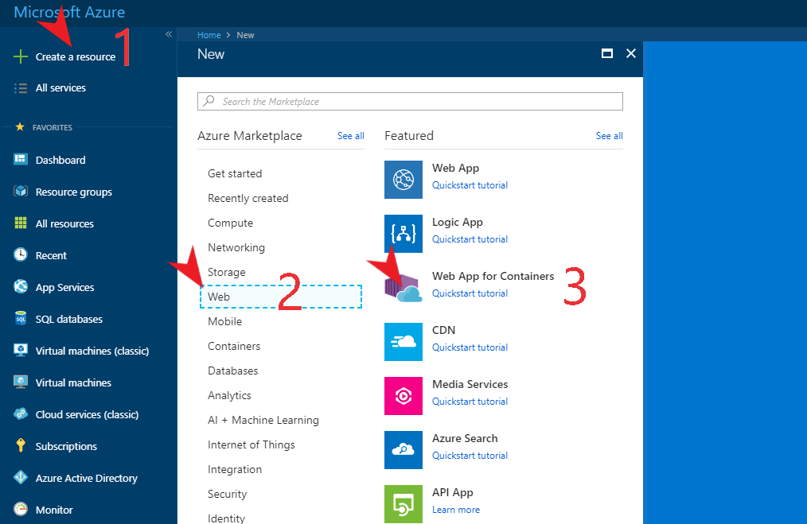
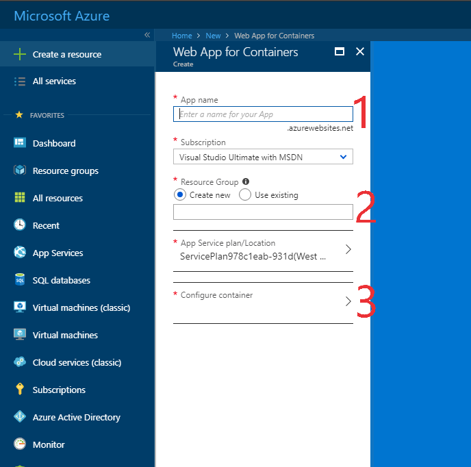
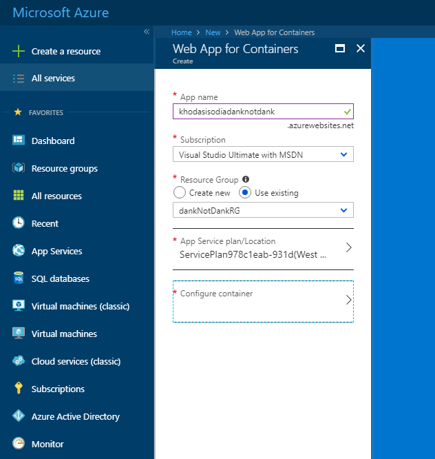
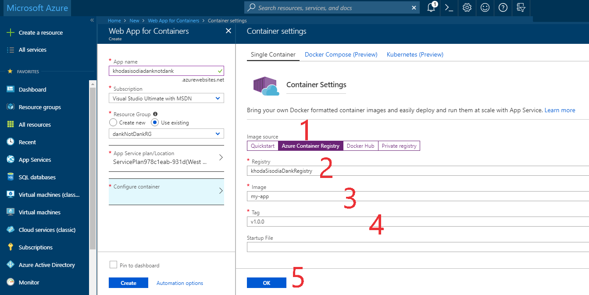
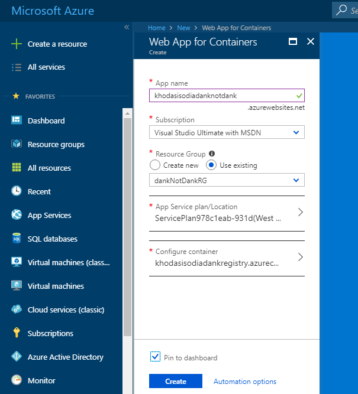
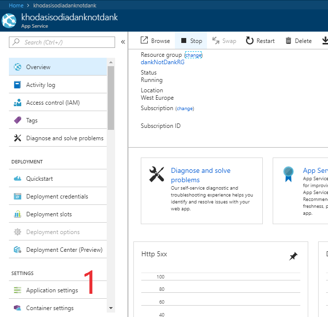
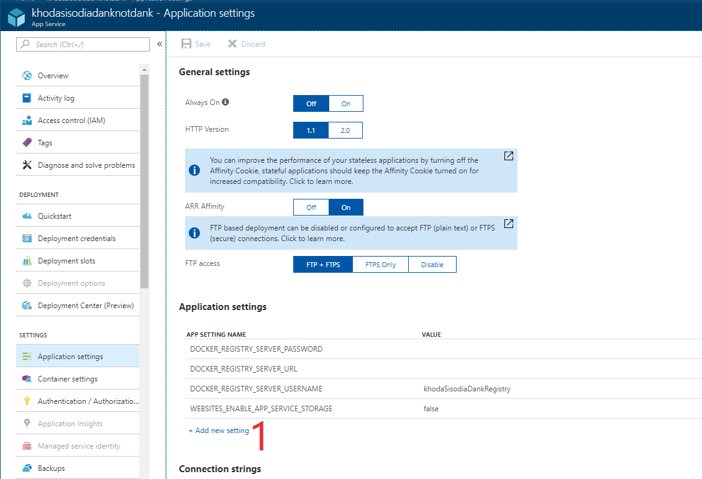
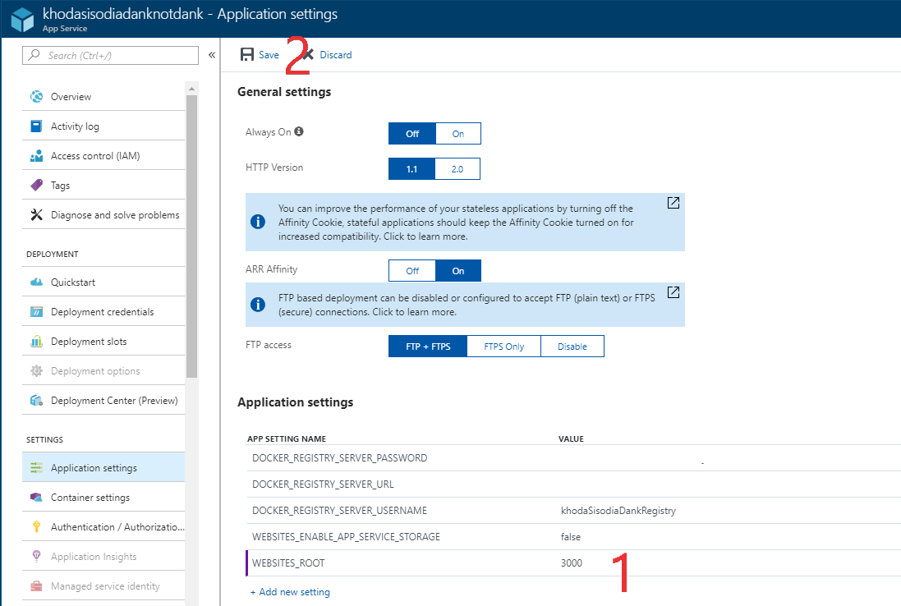
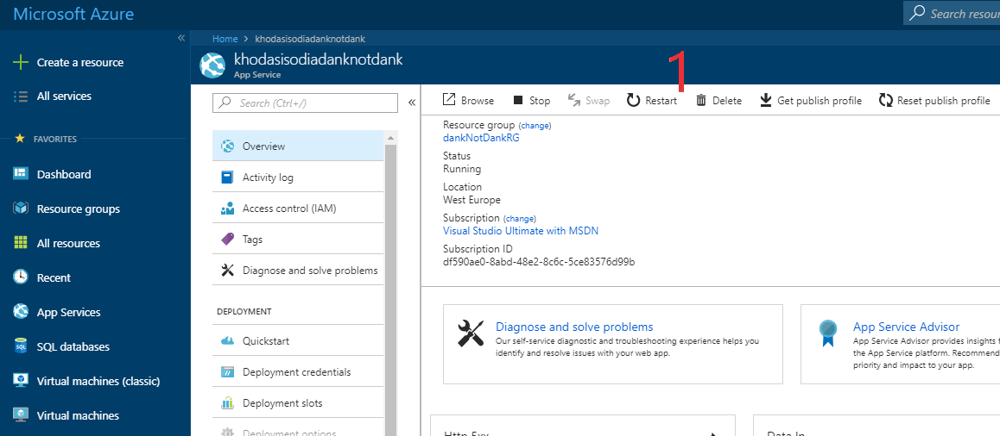

# Create a Container Registry, Push an Image to Azure Container Registry, and Use an Image for Azure Web App for Containers

In this tutorial you will learn about the Azure Container Registry (ACR) and create your own ACR. You will then subsequently push your Docker image to your newly created ACR, create a web app and deploy it. You will also learn how to redeploy if there have been changes made to your web app.


## Contents:
1. Azure Container Registry (ACR)
    - Overview 
    - Creating an ACR
    - Logging into your ACR
    

2. Web App For Containers
    - Pushing your Docker Image to ACR
    - Creating a Web App for Containers
    - Configuring your Web App to use ACR
    - Changes to the Web App and Redeployment

## Prerequisites:
- An Azure account
- Docker Installed
- Docker Image (A previous tutorial covers this process)
- Azure Cloud Shell / Azure CLI

&nbsp;

## Azure Container Registry (ACR)

### Overview
Docker registries are services that store your docker images. These registries can either be public (meaning anyone can pull a copy of your image) or private (meaning only those authenticated can pull your image). While Docker provides a free public registry, there can be cases where you will need to keep your images private. This is where Azure Docker Registry comes in handy! (Plus with your student Azure subscription you can use this for free!!).

Azure Docker Registry is a container registry serviced used to store private docker images. (A Docker image is essentially file which is a snapshot of a container. They are created based off Dockerfiles and will produce a container once run.)

### Creating an Azure Docker Registry

In order to create an ACR, we first need to create a resource group. A resource group is essentially an "id" that Azure uses to group certain resources. You can then monitor, provision and manage billing for the assets within a resource group which are used to run an application.

If you haven't done so already, please log into Azure CLI using az login in your command prompt window.

```
>az login
```
A browser will launch where you will need to enter your Azure credentials. Once successfully logged in you will receive the follow message in your cmd.
```
You have logged in. Now let us find all subscriptions you have access to...
```

Lets create a new resource group named "dankNotDankRG" in the Australia Southeast location.
```
>az group create --name dankNotDankRG --location australiasoutheast
```
 In the cmd response you should receive a key/value as below which indicates the resource group has been created successfully.
 ```
{
  "id": "/subscriptions/00000000-0000-0000-0000-000000000000/resourceGroups/dankNotDankRG",
  "location": "australiasoutheast",
  "managedBy": null,
  "name": "dankNotDankRG",
  "properties": {
    "provisioningState": "Succeeded"
  },
  "tags": null
}
 ```

Now let's create a container registry. Azure Container Registry has many different tiers (SKUs) which could can select from. There are three main SKUs: Basic, Standard, and Premium. For this tutorial we will be using Basic. The main differences between SKUs are in size and usage. If you would like to view the differences each SKU provides, please visit [Container Registry SKUs](https://docs.microsoft.com/en-us/azure/container-registry/container-registry-skus)

To create a container registry, use the az acr create command. We will need to specify our newly created resource group as above, the name of our registry (which must be unique within Azure), and the sku. As the name needs to be unique, please name it as "\<your first & last name>DankRegistry".

```
az acr create --resource-group dankNotDankRG --name khodaSisodiaDankRegistry --sku Basic
```
This can take a few minutes, so please be patient until it returns.
Once created you will get something as below:
```
{
  "adminUserEnabled": false,
  "creationDate": "2018-07-08T10:09:25.597963+00:00",
  "id": "/subscriptions/00000000-0000-0000-0000-000000000000/resourceGroups/dankNotDankRG/providers/Microsoft.ContainerRegistry/registries/khodaSisodiaDankRegistry",
  "location": "australiasoutheast",
  "loginServer": "khodasisodiadankregistry.azurecr.io",
  "name": "khodaSisodiaDankRegistry",
  "provisioningState": "Succeeded",
  "resourceGroup": "dankNotDankRG",
  "sku": {
    "name": "Basic",
    "tier": "Basic"
  },
  "status": null,
  "storageAccount": null,
  "tags": {},
  "type": "Microsoft.ContainerRegistry/registries"
}
```
Before we can push or pull container images, we need to first supply our credentials so that the registry accepts the push. In order to obtain the credentials, we will use the az acr show command. In some cases we need to enabled the admin user. To do this:

```
>az acr update --name khodaSisodiaDankRegistry --admin-enabled true
```

You will now note that key "adminUserEnabled has been set to true ``` "adminUserEnabled": true```.

Now lets get the credentials. Enter in the following command. In the --name parameter enter in your own registry name which was created earlier.
```
az acr credential show --name khodaSisodiaDankRegistry
```

This should return something similar to below (but the value will have the proper passwords):
```
{
  "passwords": [
    {
      "name": "password",
      "value": "123456789abcdef"
    },
    {
      "name": "password2",
      "value": "<another value>"
    }
  ],
  "username": "khodaSisodiaDankRegistry"
}
```

Now lets log in to ACR. We will use the command ```docker login``` followed by ```<your-azure-container-registry-name>.azurecr.io --username <registry-username>```. The ```<registry-username>``` is found from the previous command i.e. : ```"username": "khodaSisodiaDankRegistry"```

```
docker login khodaSisodiaDankRegistry.azurecr.io --username khodaSisodiaDankRegistry
```

Once entered, you will be prompted for a password. Enter the value of the password from your cmd which was obtained earlier, ie "123456789abcdef". For security reasons, if you copy-paste your password it wont show up on the cmd, so just hit enter once pasted.

If successful you will get the following message:
```
Login Succeeded
```
### Depending on how your image was built you may need to tag it. If this is the case please follow the below tagging process, else continue to the push.
>As we will be using our own image, you may need to first tag it as follows: ```docker tag <image-id> <azure-container-registry-name>.azurecr.io/mydockerimage```
>
>To get the image id, we will run command:
>```
> >docker images
>```
>
>You will be returned a list of images. Under the image you want to push, copy its corresponding image id.
>
>```
>REPOSITORY                                      TAG                 IMAGE ID            CREATED             SIZE
>khodaSisodiaDankRegistry.azurecr.io/dankimage   v1.0.0             b41ff7640e43         About an hour ago ago         840MB
>node                                            8.11.3              c5e9a81034a9        45 hours ago        673MB
>```
>b41ff7640e43 is the image ID for my image, however this will be different for you.
>
>Lets proceed to tag our image:
>
>```
> >docker tag b41ff7640e43 khodaSisodiaDankRegistry.azurecr.io/dankimage:v1.0.0
>```

Now lets push our Docker Image (which was created in a previous tutorial). To do this we use the docker push command with parameters as follows:  ```<your-azure-container-registry-name>.azurecr.io/<your-docker-image-name>:v1.0.0```

In my case, my command will be:
```
>docker push khodaSisodiaDankRegistry.azurecr.io/dankimage:v1.0.0
```

Pushing the image will take some time, so please be patient.

To verify your image has successfully pushed you can list all the images in your registry as follows: ```az acr repository list -n <azure-container-registry-name>```
```
>az acr repository list -n khodaSisodiaDankRegistry

[
  "dankimage"
]
```


All thats left to do now is to create a web app for containers and configure it to run a container stored in your Azure Container Registry.

## Create a web app using a container
To create the web app using a container, we will need to use [Azure Portal](portal.azure.com) for this.

Once logged in, select (1) "Create a resource" from the left menu, select (2) "Web", and then click (3) Web app for containers.



We now need to fill out some details for this new web app we plan to create.



1. This will be your app name, and subsequently the URL for your web app. This needs to be unique (so if you copy the one I use, it wont work!!). You're more than welcome to name it whatever you like, though if you're stuck, feel free to use your name followed by danknotdank.

2. This is where you select your resource group. We created one right at the beginning of this tutorial (remember!?), so let's use that.

- The App Service plan will determine the location, features, cost, and compute resource your web app will have. You can make changes to this if you wish, however using the default created one is fine for this tutorial.

3. Configure container. This is where you select which container registry your docker image is located in, the image name, and version. More details on this below.

So far your web app creation should look something like:



Let's configure the container.



1. As we have created and pushed our docker image to Azure Container Registry, let's go ahead and select that.

2. Select your registry name.

3. Select your docker image.

4. Select the tag.

>- We do not need to specify a startup file, as this will be discovered automatically.

5. Click OK to save your container configuration.


Once this is all done, your window should look something like:



Before you go ahead and click "Create", it's best to select the "Pin to dashboard" checkbox. This will create a shortcut to your web app on your Azure dashboard for easy access.

Azure will take a few moments to create your web app. Once successful click on your web app, as we need to configure some settings on it. (In some cases your web app will open automatically once successfully create.)



What we need to do now is configure our exposed port number. If you recall earlier to the Dockerfile tutorial, you would have noticed a line similar to "hs -p 3000". This sets the port our image uses to 3000. Azure web apps currently only expose ports 80 and 443, therefore we need to tell Azure what port our image uses.

On the left menu of your App Service, you will note a menu item (1) "Application Settings". Click it.




Select the (1) "Add new setting" link. We need to add a Key/Value pair which tells Azure about our different port number. The key is "WEBSITES_ROOT", with the value being 3000 (or whatever your dockerfile uses).


Once entered, click (2) save on the top of the window.




One last thing we need to do is restart our web app. This isn't always neccessary, but it allows us to be certain that Azure will use the newly specified setting. To do this, select "Overview" from the left menu and select (1) "Restart".



Once your web app has restarted, click the link under the URL heading on the window (This is located to the slight bottom right of the restart button).

This should open a new tab with a white screen. Depending on your internet connection it can take up to 10 minutes for your web app to load the first time. This is presummably due to the intialisation of the docker container. Any subsequent visits to your web app will be much quicker.

> Note: If once loaded, you are displayed with a 502 error, simply refresh the page.

Congratulations, you've successfully created a web app using a container! If you navigate to your URL (the name of your webapp + .azurewebsites.net; in this tutorial's case: https://khodasisodiadanknotdank.azurewebsites.net/), you should be able to view your web app!
